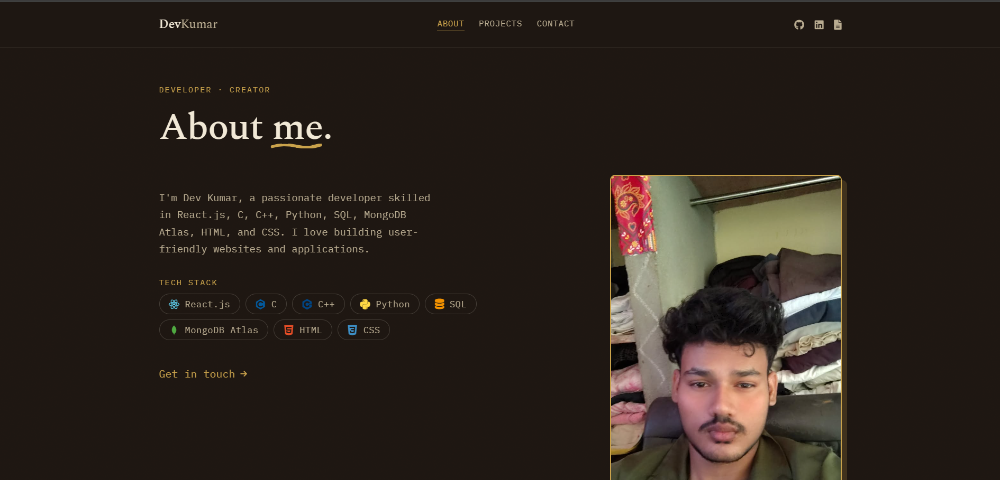
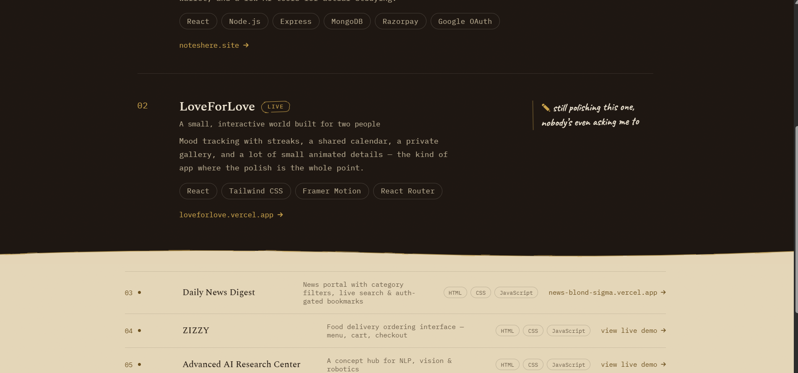
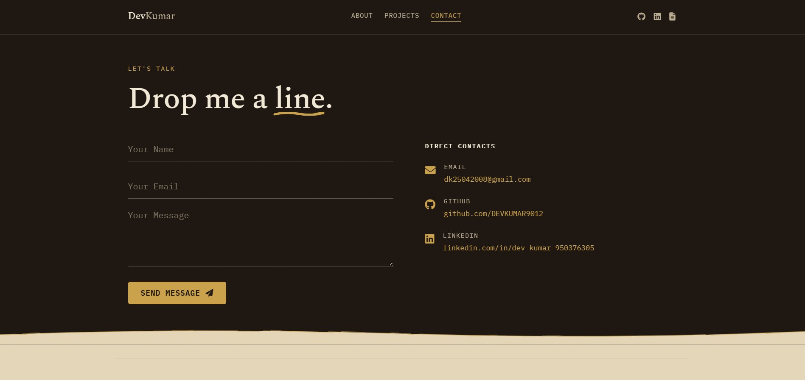

# 🌟 Dev Kumar – Personal Portfolio Website

Welcome to my personal portfolio repository! 🚀  
This website showcases my journey as a developer, featuring my technical skills, shipped projects, and contact details built with a modern, responsive **Build Log** theme.

---

## 🔗 Live Demo
👉 **[Visit Live Portfolio](https://myportfolio-vert-six-67.vercel.app/)**

---

## 📑 Page Overview

- **👤 About (Home)** – Personal introduction, profile picture, and full tech stack with official icons.
- **💻 Projects** – Chronological log of shipped full-stack and web applications with live links and details.
- **📬 Contact** – Interactive message form and direct contact links (Email, GitHub, LinkedIn).

---

## 📸 Visual Previews

### 👤 About Page


### 💻 Projects Page


### 📬 Contact Page


---

## 🛠️ Tech Stack

- **Frontend & Core:** React.js, HTML5, CSS3, JavaScript
- **Languages:** C, C++, Python, SQL
- **Database & Cloud:** MongoDB Atlas
- **Icons & Styling:** FontAwesome & Devicon
- **Deployment & Version Control:** Vercel, Git & GitHub

---

## 📂 Project Structure

```bash
myportfolio/
├── index.html       # Main Home page (About)
├── about.html       # About section
├── projects.html    # Projects showcase
├── contact.html     # Contact page
├── theme.css        # Main stylesheet & tokens
├── script.js        # Interactive scripts
├── resume.pdf       # Downloadable resume
└── ss/              # Screenshots & images
```
